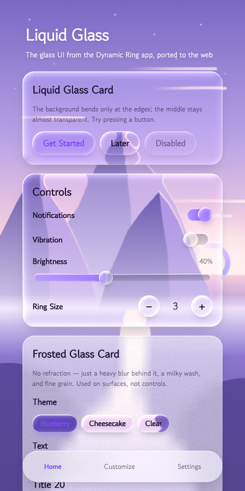
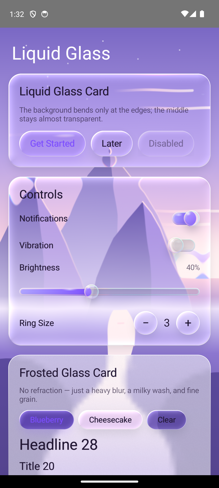

# Liquid Glass UI

A **liquid glass / frosted glass** UI kit for Jetpack Compose and the web (WebGL2).
Lifted directly from the glass UI used in the Android app *Dynamic Ring*. No screen capture, no accessibility service, no hidden APIs.

| Web demo (`web/index.html`) | Android sample (`android/sample`) |
|---|---|
|  |  |

## Layout

```
liquid_glass_github/
├─ android/
│  ├─ liquidglass/
│  │  ├─ LiquidGlass.kt      GlassBackground, Modifier.liquidGlass, Modifier.frostedGlass, AGSL shader
│  │  ├─ GlassControls.kt    glass3D, GlassButton, GlassRoundButton, GlassSwitch, GlassSlider, GlassLabel
│  │  └─ DawnLandscape.kt    sample background (a dawn mountain scene) and 3 palettes
│  └─ sample/
│     └─ SampleScreen.kt     example app screen
├─ web/
│  └─ index.html             single-file demo (no build step)
└─ docs/                     screenshots
```

## How it works

The glass **does not capture the screen behind it every frame.** The app's background is painted once, and each glass piece refracts its own patch of that one picture through a shader.

1. **One background.** `GlassBackground` paints the background once into a bitmap at 1/1.5 screen size. The same picture is halved repeatedly down to a 1/24-size copy (the frost). Both are repainted only when the theme or screen size changes.
2. **Liquid glass** (`Modifier.liquidGlass`). Each glass piece draws its own patch of the background bitmap through an AGSL `RuntimeShader`.
   - **Shape.** A rounded-rect SDF gives the distance to the edge and the outward-facing normal.
   - **Convex refraction.** Inside the bezel (`bezel`), the sample point is pulled inward by `refraction × (1 − t)^2.2`. So the background bends only near the edge and stays untouched in the middle.
   - **Dispersion.** Where it bends, R and B are pulled by slightly different amounts, splitting off a thin rainbow fringe.
   - **Surface.** A 1.5px blur, ×1.15 saturation, a very light tint, and a slow sine warp that ripples the surface faintly.
   - **Light.** A rim specular plus 2px (top-left) / 1px (bottom-right) inset highlights.
3. **Frosted glass** (`Modifier.frostedGlass`). Upsampling the 1/24 copy with bilinear filtering *is* the blur. On top of it sits a milky white wash (55%), fine grain, and a top-bright 1dp rim — no refraction. Used for surfaces, not controls.
4. **Shadow.** A wide, soft shadow from `BlurMaskFilter`, drawn **only outside** the glass (`ClipOp.Difference`), so grey never shows through transparent glass.
5. **On press.** It squashes like a drop (+3.5% wide, −6% tall, spring damping 0.42). Light pools under the finger, the lens bulges (refraction ×1.6), and the shadow tightens.

The web demo ports the same shader to GLSL ES 3.00 and draws every glass piece in a single full-screen pass. Each element's position (`getBoundingClientRect`) is uploaded as a uniform every frame.

## Using it on Android

**Requirements:** Jetpack Compose, Material3, minSdk 24+.
- Liquid glass only renders on API 33+ (`RuntimeShader`).
- Below that, only the rim and shadow remain — no refraction. Frosted glass works on every version.

1. Copy `android/liquidglass/*.kt` into your project. The package is `io.github.liquidglass`.
2. Wrap your screen in `GlassBackground`, and use the glass components inside it.

```kotlin
setContent {
    GlassBackground(painter = { drawDawnLandscape(it, DawnPalette.Lilac) }) {
        Column(Modifier.padding(16.dp)) {
            GlassButton("Get Started", onClick = {}, accent = Color(0xFF7C4DFF))
            GlassButton("Later", onClick = {})

            var on by remember { mutableStateOf(true) }
            GlassSwitch(on, { on = it })

            var v by remember { mutableFloatStateOf(0.4f) }
            GlassSlider(v, { v = it })

            Column(Modifier.frostedGlass(RoundedCornerShape(24.dp)).padding(20.dp)) {
                Text("Frosted card")
            }
        }
    }
}
```

The background can be any `DrawScope` painting (`painter`). Pass the theme as `key` when switching themes, and the background repaints.

### API

| Name | Description | Key args (defaults) |
|---|---|---|
| `GlassBackground` | Paints the background and shares it with glass below | `painter`, `key` |
| `Modifier.liquidGlass` | Refracting transparent glass | `corner`, `bezel` 14dp, `refraction` 22dp, `tint` white 5%, `dispersion` 0.10, `ripple` 2dp, `bulge` |
| `Modifier.frostedGlass` | Blurred, milky glass | `shape`, `frost` white 55%, `shadow` true |
| `Modifier.glass3D` | A pressable glass body (shadow + refraction + light pooling + rim) | `source`, `accent`, `enabled` |
| `GlassButton` / `GlassRoundButton` | Pill / round buttons | `accent` null = clear button |
| `GlassSwitch` / `GlassSlider` | A glass knob that lenses its track | `accent` |
| `GlassLabel` | Text at roughly 30% of a bold | `color`, `fontSize` |

Values used in the app:

| Use | corner | bezel | refraction | tint | ripple |
|---|---|---|---|---|---|
| Card | 24dp | 26dp | 30dp | white 10% | 1dp |
| Button | 999dp | 16dp | 20dp | white 4% / accent 16% | 2dp |

If the refraction is strong enough that the background bends like a flame, lower `refraction` and `ripple`. If the glass looks murky, lower the `tint` alpha.

## Web demo

Open `web/index.html` in a browser — no build step, no server needed.

- Any element with `data-glass` becomes glass. Five kinds: `card`, `button`, `knob`, `frost`, `track`.
- Tune values in the file's `PRESET` object. It uses the same values as Android, in CSS px.
- Clicking a theme chip converts the background and accent color to that theme.
- Falls back to CSS `backdrop-filter` when WebGL2 isn't available.

## Limitations

- Only the **app background** is refracted. Other content scrolling underneath the glass is not refracted — in exchange, it's cheap and needs no capture permission.
- On the web, the glass is drawn on a canvas behind the DOM. So fixed elements floating over other content (e.g. the bottom tab bar) use the browser's own `backdrop-filter` instead.
- Slider and switch knobs lens the track directly beneath them, not the background.

## License

Code: see the LICENSE file at the repository root.
MitmiFont, used in the Dynamic Ring app, carries modification/redistribution restrictions and is **not included.** The demo uses system fonts and Google Fonts' Gowun Dodum.
